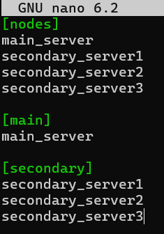
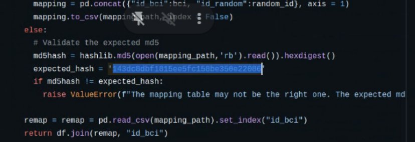
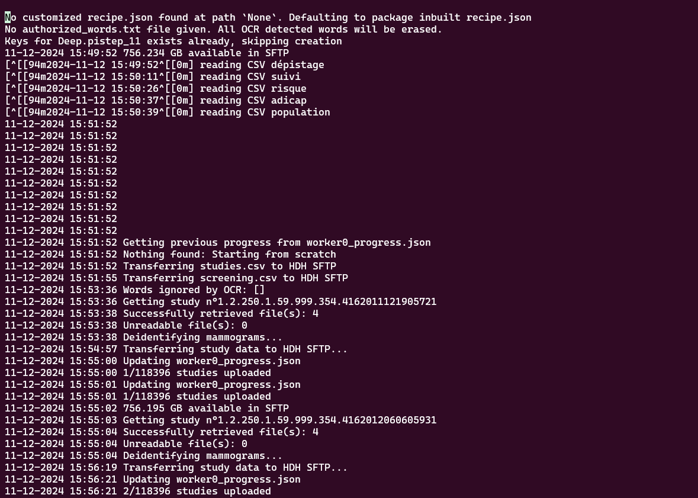

# deep.piste

Tools for implementing Deep.piste study.

## Installation

### Prerequisites

**On windows:**

You may need to install ["Visual C++ Redistributable Packages for Visual Studio 2013" Microsoft C++ Build Tools](https://www.microsoft.com/en-us/download/details.aspx?id=40784).

**On Ubuntu:**
```bash
sudo apt-get install python3-tk
```

### Installation

```bash
pip install deep-piste
```

### Installation for contributors

1. Download source code

```bash
git clone https://github.com/Epiconcept-Paris/deidcm.git
git clone https://github.com/Epiconcept-Paris/deep.piste.git
```

2. Create and activate a virtual environment

```bash
cd deep.piste/
python3 -m venv env
. env/bin/activate
```

3. Install [deidcm](https://github.com/Epiconcept-Paris/deidcm)

```bash
cd ../deidcm
pip install -e .
```

4. Install deep.piste

```bash
cd ../deep.piste
pip install -e .
```

### Checking installation

1. Checking deidcm installation

Open a python interpreter and try to deidentify a dicom file:
```python
from deidcm.dicom.deid_mammogram import deidentify_image_png

deidentify_image_png(
    "/path/to/mammogram.dcm",
    "/path/to/processed/output-folder",
    "output-filename"
)
```

2. Checking deep.piste installation

When writing the following command, you should be able to see the help menu:
```bash
>>> python3 -m dpiste -h

usage: __main__.py [-h] {extract,transform,export,backup} ...

positional arguments:
  {extract,transform,export,backup}
	extract         	Invoke initial extractions commands
	transform       	Perform transformation on input data
	export          	Sending data
	backup          	Back up data

options:
  -h, --help        	show this help message and exit
```

## Tools for developers

## Installation

```bash
pip install -e .[quality-tools]
```

## Test and Test Coverage

### Tests

Run all tests
```py
pytest
```

### Calculate and Visualize Test Coverage

1. Run test coverage
```py
coverage run --omit="*/test*,*/deidcm/*" -m pytest
```

2. Visualize report in terminal
```py
coverage report -i
```

## Formatter and Linter

Format your files with `python3 -m autopep8 --in-place file/to/format`

Lint your files with `python3 -m pylint file/to/lint`

## Procedure for transferring screening data to the Health Data Hub (HDH) servers

__Epiconcept server is used as a hub for screening data collection before all data can be sent via Secure File Transfer Protocol (SFTP) to the HDH server.__

### Procedure for extracting screening data from CRCDC database to Epiconcept server

#### Design

* Screening data from the CRCDC (screening regional coordination center) need to be collected from Neoscope on CRCDC workstation and sent __encrypted__ via Epifiles to the Epiconcept server. 
* This step requires the Epiconcept data manager to intervene on the CRCDC operator workstation.


#### Prerequisites

* Prerequisites on CRCDC operator workstation : 
  - Python 3.8.12 with tkinter
  - Visual C++ Redistributable Packages for Visual Studio 2013
  - Deep.piste package (python -m pip install deep.piste) installed on python3 virtual environment
  - Screening data extracted by CRCDC operator with the following requests : replace _date1_ and _date2_ below by actual dates

[__Women list request__](./docs/SQL_requests/women_list)

[__Women at risk request__](./docs/SQL_requests/women_at_risk_list.sql)

[__Screening track record__](./docs/SQL_requests/screening_records.sql)

[__Diagnosis__](./docs/SQL_requests/diagnoses.sql)

[__Adicap codes__](./docs/SQL_requests/adicap.sql)

[__Radiology centers__](./docs/SQL_requests/radiology_centers.sql)

#### Running the export

* The Epiconcept data manager generates encryption QR code on local machine with deep.piste package : 
```py
python -m dpiste extract neoscope generate-qr-key
```
* From CRCDC operator with prerequisites, run:
```py
python -m dpiste extract neoscope encrypt -w
```
* Upload encrypted data from CRCDC operator workstation to Epifiles
* From  Epiconcept server, pull from Epifiles with QR code copied to clipboard : 
```py
python -m dpiste extract neoscope pull2bigdata -u [epfiles-user]
```

#### Results

zipped folder __extraction_neoscope.zip__ loaded on Epiconcept server containing screening data for perimeter defined in requests above.

### Procedure for extracting esis dicom metadata

* The Epiconcept data manager opens an extraction request on Esis-3D portal, containing the following SQL request:

[Esis extraction request](./docs/SQL_requests/esis_extraction.sql)

* Resulting file from esis extraction : esis_dicom_guid.parquet

### Procedure for running the export

#### Prerequisites

* All files must be on an Epiconcept server :
```
├── input
│   ├── crcdc
│   │   └── refusing-list.csv # list of patients excluded from study perimeter
│   ├── easyocr
│   │   ├── craft_mlt_25k.pth # weights of easy ocr model for images anynomization
│   │   └── latin_g2.pth # weights of easy ocr model for images anynomization
│   ├── epiconcept
│   │   ├── mapping-table.csv # mapping table between patient ids and pseudo ids
│   │   └── ocr_deid_ignore.txt # text elements to be ignored at anonymization step
│   ├── esis
│   │   └── esis_dicom_guid.parquet # esis extraction described above
│   ├── hdh
│   │   └── p11_encryption_public.rsa # encryption public ssh key provided by HDH operator (open HDH Zendesk ticket)
│   └── neo
│   	└── extraction_neoscope.zip # neoscope CRCDC extraction described above
└── output
	├── cnam
	│   ├── duplicates_to_keep.csv # list of duplicate entries to keep
	│   └── safe.zip
	└── hdh
    	├── p11_transfer_private_key.rsa # signature ssh key generated by Epiconcept data manager
    	└── p11_transfer_public_key.rsa # signature ssh public key, to send to HDH operator in a secure manner
```
* On local Epiconcept data manager workstation : 
  - deep.piste package installed in a Python 3.10 venv (might work with another Python, but tested in 3.10 only)
  - inside deep.piste package, dpiste/ansible/export_hdh/hosts filled with ssh hosts info (the same as used to connect to Epiconcept servers)


  
  - Open an update ansible/group_var/nodes.yml file with latest config info :


    - ssh_user (name of epiconcept operator on Epiconcept servers)
    - ssh_source_key (path to private ssh key to connect to Epiconcept servers)
    - ssh_source_key_pub : idem but public key
    - python_path : path to python on each one of the Epiconcept servers, python is to be installed by operator if not done already (Python 3.8 used in 2024)
    - dp_home : path to the folder (not the deep.piste package) containing _data_ folder with all data required for transfer (see above)
    - dp_code = dp_home

  - Epiconcept operator must install Pass on his local workstation and have the 3 following keys:
    - infra/bgdt : password to sudo on Epiconcept servers, provided by Epiconcept infra  
    - infra/sshpassphrase : ssh key passphrase to connect to Epiconcept servers
    - epitools/hdh_epi_transfer_passphrase : passphrase for ssh signature key (stored at path SERVER:/space/Work/operator/github/deep.piste/data/output/hdh)

  - Finally, check all lines of roles/node/tasks/main.yml :
    - update user name when it is hardcoded
    - update Python version and paths if you have a different config

* Epiconcept servers preparation :
  - After getting access rights to SFTP, transfer unchanged files from sftp to Epiconcept server with DP_HOME which will be used for transfer : from sftp run command:
  ```
  SERVER get -R input_data /home/operator/DP_HOME/data/input
  ```
  - Check hash of mapping_table.csv : the expected hash is in blue

  

#### Running export

From activated venv on local workstation, run command from dpiste/ansible/export_hdh cwd :
```
ansible-playbook export-data-hdh.yml -i hosts
```

#### Expected output :



__NB__ : command to stop export 
```
ansible-playbook export-data-hdh.yml -t stop -i hosts
```