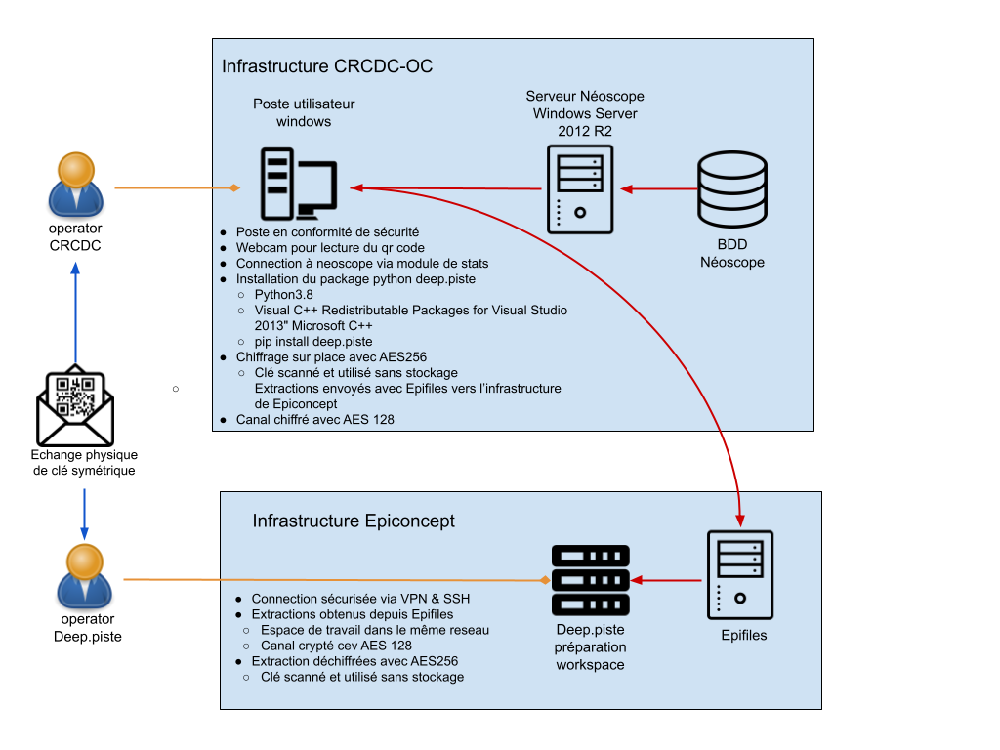
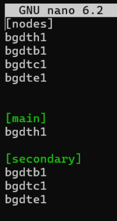
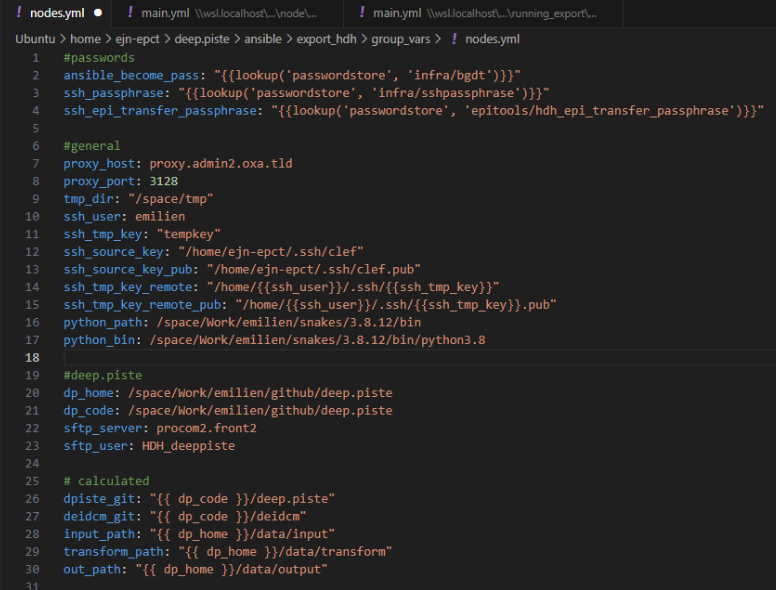

# deep.piste

Tools for implementing Deep.piste study.

## Installation

### Prerequisites

**On windows:**

You may need to install ["Visual C++ Redistributable Packages for Visual Studio 2013" Microsoft C++ Build Tools](https://www.microsoft.com/en-us/download/details.aspx?id=40784).

**On Ubuntu:**
```bash
sudo apt-get install python3-tk
```

### Installation

```bash
pip install deep-piste
```

### Installation for contributors

1. Download source code

```bash
git clone https://github.com/Epiconcept-Paris/deidcm.git
git clone https://github.com/Epiconcept-Paris/deep.piste.git
```

2. Create and activate a virtual environment

```bash
cd deep.piste/
python3 -m venv env
. env/bin/activate
```

3. Install [deidcm](https://github.com/Epiconcept-Paris/deidcm)

```bash
cd ../deidcm
pip install -e .
```

4. Install deep.piste

```bash
cd ../deep.piste
pip install -e .
```

### Checking installation

1. Checking deidcm installation

Open a python interpreter and try to deidentify a dicom file:
```python
from deidcm.dicom.deid_mammogram import deidentify_image_png

deidentify_image_png(
    "/path/to/mammogram.dcm",
    "/path/to/processed/output-folder",
    "output-filename"
)
```

2. Checking deep.piste installation

When writing the following command, you should be able to see the help menu:
```bash
>>> python3 -m dpiste -h

usage: __main__.py [-h] {extract,transform,export,backup} ...

positional arguments:
  {extract,transform,export,backup}
	extract         	Invoke initial extractions commands
	transform       	Perform transformation on input data
	export          	Sending data
	backup          	Back up data

options:
  -h, --help        	show this help message and exit
```

## Tools for developers

## Installation

```bash
pip install -e .[quality-tools]
```

## Test and Test Coverage

### Tests

Run all tests
```py
pytest
```

### Calculate and Visualize Test Coverage

1. Run test coverage
```py
coverage run --omit="*/test*,*/deidcm/*" -m pytest
```

2. Visualize report in terminal
```py
coverage report -i
```

## Formatter and Linter

Format your files with `python3 -m autopep8 --in-place file/to/format`

Lint your files with `python3 -m pylint file/to/lint`

## Procedure for transferring screening data to the Health Data Hub (HDH) servers

__Epiconcept server (bgdt machines) serves as a hub for screening data collection before all data can be sent via Secure File Transfer Protocol (SFTP) to the HDH server.__

### Procedure for extracting screening data from CRCDC database to Epiconcept server

#### Design

* Screening data from the CRCDC (screening regional coordination center) need to be collected from Neoscope on CRCDC workstation and sent __encrypted__ via Epifiles to the Epiconcept server. 
* This step requires the Epiconcept data manager to intervene remotely on the CRCDC operator with Teamviewer or another remote control software.



#### Prerequisites

* Prerequisites on CRCDC operator workstation : 
  - Python 3.8.12 with tkinter
  - Visual C++ Redistributable Packages for Visual Studio 2013
  - Deep.piste package (python -m pip install deep.piste) installed on python3 virtual environment
  - Screening data extracted by CRCDC operator with the following requests : replace _date1_ and _date2_ below by actual dates

__Women list request__ :

```SQL
select assure.num_ref, assure.id_assure, assure.id_bci, assure.NNI_2, assure.NNI_2_cle, assure.sexe, assure.nom, assure.nom_jf, assure.prenom, assure.date_naiss, assure.email, count(*)
from assure join ks using (id_assure)
where ks.date_mammo between "date1" and "date2"
group by 1, 2, 3, 4, 5, 6, 7, 8, 9, 10, 11
```

__Women at risk request__ :

```SQL
select assure.num_ref, assure.id_assure, assure.id_bci,
ks.id_event, Ks.Date_Mammo,
(datediff(Ks.Date_mammo,Assure.Date_Naiss)/365.25) as Age_Mammo,

if(Ks.Menop_Trai="O","Oui","Non") as THS,
if(Ks.Maladie_an_d="k" or Ks.Maladie_an_G="k","Oui","Non") as ATCD_Cancer,
if(Ks.Maladie_an_d="k" or Ks.Maladie_an_G="k",datediff(Ks.Operation_Date,Assure.Date_Naiss)/365.25," ") as Age_ATCD_Cancer,
if(Ks.Maladie_an_d="k" and Ks.Maladie_an_G="k","Oui","Non") as ATCD_Cancer_Bilateral,
if(Ks.Maladie_an_d="k" and Ks.Maladie_an_G="k",datediff(Ks.Operation_Date,Assure.Date_Naiss)/365.25," ") as Age_ATCD_Cancer_Bilateral,
if(Ks.Maladie_an_d="E" or Ks.Maladie_an_G="E","Oui","Non") as ATCD_Chir_Esth,
if(Ks.Maladie_an_d="E" or Ks.Maladie_an_G="E",datediff(Ks.Operation_Date,Assure.Date_Naiss)/365.25," ") as Age_ATCD_Chir_Esth,
if(Ks.Ant_Age_Mere="O","O","N") as ATCD_Famil_Mere,
if(Ks.Ant_Age_Mere="O",KS.Age_Mere," ") as Age_ATCD_Famil_Mere,
if(Ks.Ant_Age_soeur="O","O","N") as ATCD_Famil_Soeur,
if(Ks.Ant_Age_soeur="O",Ks.Age_Soeur," ") as Age_ATCD_Famil_Soeur,
if(Ks.Ant_Age_fille="O","O","N") as ATCD_Famil_Fille,
if(Ks.Ant_Age_fille="O",Ks.Age_fille," ") as Age_ATCD_Famil_Fille,
if(Ks.Ant_Age_autre="O","O","N") as ATCD_Famil_Autre,
if(Ks.Ant_Age_autre="O",Ks.Age_autre," ") as Age_ATCD_Famil_Autre

from assure join ks using (id_assure)
where ks.date_mammo between "date1" and "date2"
```

__Screening track record__ :

```SQL
select assure.num_ref, assure.id_assure, assure.id_bci, 
Ks.Id_event, Ks.Date_Mammo, 
If(Ks.Comp_Re_1D="S","anomalie SD plus suspecte",
If(Ks.Comp_Re_1D="S","anomalie SD apparue"," ")) as comparaison_SD,
If(Ks.Comp_Re_1G="S","anomalie SG plus suspecte",
If(Ks.Comp_Re_1G="S","anomalie SG apparue"," ")) as comparaison_SG,
if(Ks.Exam_Clini="A","Anormal",if(Ks.Exam_Clini="N","Normal",if(Ks.Exam_Clini="R","Refusé"," "))) as ECS, 
Ks.Acr_SD11 as L1_ACR_SD,
Ks.ACR_SG11 as L1_ACR_SG,
if(Ks.Suspec11_D="A","Opacité à contour spiculé", 
if(Ks.Suspec11_D="B","Opacité à contour non spiculé", 
if(Ks.Suspec11_D="C","Microcalcifications", 
if(Ks.Suspec11_D="D","Opacité avec Microcalcifications", 
if(Ks.Suspec11_D="E","Anomalie Architecturale", 
if(Ks.Suspec11_D="F","Densité focale Asymétrique", 
if(Ks.Suspec11_D="G","Autres anomalie"," "))))))) as L1_Type_Image_SD,
if(Ks.Suspec11_G="A","Opacité à contour spiculé", 
if(Ks.Suspec11_G="B","Opacité à contour non spiculé", 
if(Ks.Suspec11_G="C","Microcalcifications", 
if(Ks.Suspec11_G="D","Opacité avec Microcalcifications", 
if(Ks.Suspec11_G="E","Anomalie Architecturale", 
if(Ks.Suspec11_G="F","Densité focale Asymétrique", 
if(Ks.Suspec11_G="G","Autres anomalie"," "))))))) as L1_Type_Image_SG,
if(Ks.Echo_l1="O","Echo réalisé sur mammo négative","Non") as Echo_L1,
if(Ks.Echo_L1_Suspecte="O","Echo_L1_Suspecte","Non") as Echo_ECS_L1_Suspecte,
if(Ks.Bilan_L1="O","Bilan immédiat nécessaire","Pas de BDI") as BDI,
if(Ks.Bi_Agrand="O","BDI_Agrandissement","Non") as BDI_Agrandissement,
if(Ks.Bi_Cyto="O","BDI_Cytoponction","Non") as BDI_Cytoponction,
if(Ks.Bi_Echo="O","BDI_Echographie","Non") as BDI_Echographie,
Ks.Acr_Sd1 as BDI_ACR_SD,
Ks.Acr_Sg1 as BDI_ACR_SG,
if(Ks.Suspec1_Sd="A","Opacité à contour spiculé", 
if(Ks.Suspec1_Sd="B","Opacité à contour non spiculé", 
if(Ks.Suspec1_Sd="C","Microcalcifications", 
if(Ks.Suspec1_Sd="D","Opacité avec Microcalcifications", 
if(Ks.Suspec1_Sd="E","Anomalie Architecturale", 
if(Ks.Suspec1_Sd="F","Densité focale Asymétrique", 
if(Ks.Suspec1_Sd="G","Autres anomalie"," "))))))) as BDI_Type_Image_SD,
if(Ks.Suspec1_Sg="A","Opacité à contour spiculé", 
if(Ks.Suspec1_Sg="B","Opacité à contour non spiculé", 
if(Ks.Suspec1_Sg="C","Microcalcifications", 
if(Ks.Suspec1_Sg="D","Opacité avec Microcalcifications", 
if(Ks.Suspec1_Sg="E","Anomalie Architecturale", 
if(Ks.Suspec1_Sg="F","Densité focale Asymétrique", 
if(Ks.Suspec1_Sg="G","Autres anomalie"," "))))))) as BDI_Type_Image_SG,
if(Ks.Exam_Cons1 IN ("S03","S04","S05","S06","S09","S12","S18","S24") or Ks.Exam_Cons_Echo_L1 IN ("S03","S04","S05","S06","S09","S12","S18","S24"),"Surveillance","Non") as BDI_CAT_Surveillance,
if(Ks.Exam_Cons1 IN ("PCY") or Ks.Exam_Cons_Echo_L1 IN ("PCY"),"Exam_Cytoponction","Non") as BDI_CAT_Cytoponction,
if(Ks.Exam_Cons1 IN ("PMI") or Ks.Exam_Cons_Echo_L1 IN ("PMI"),"Exam_Microbiopsie","Non") as BDI_CAT_Microbiopsie,
if(Ks.Exam_Cons1 IN ("PMA") or Ks.Exam_Cons_Echo_L1 IN ("PMA"),"Exam_Macrobiopsie","Non") as BDI_CAT_Macrobiopsie,
if(Ks.Exam_Cons1 IN ("AUT","IRM","PCH","PRP") or Ks.Exam_Cons_Echo_L1 IN ("AUT","IRM","PCH","PRP"),"Autre Prise en Charge","Non") as BDI_CAT_AutrePEC,
Ks.Acr_Sd2 as L2_ACR_SD_SD,
Ks.Acr_Sg2 as L2_ACR_SD_SG,
if(Ks.Suspec2_Sd="A","Opacité à contour spiculé", 
if(Ks.Suspec2_Sd="B","Opacité à contour non spiculé", 
if(Ks.Suspec2_Sd="C","Microcalcifications", 
if(Ks.Suspec2_Sd="D","Opacité avec Microcalcifications", 
if(Ks.Suspec2_Sd="E","Anomalie Architecturale", 
if(Ks.Suspec2_Sd="F","Densité focale Asymétrique", 
if(Ks.Suspec2_Sd="G","Autres anomalie"," "))))))) as L2_Type_Image_SD,
if(Ks.Suspec2_Sg="A","Opacité à contour spiculé", 
if(Ks.Suspec2_Sg="B","Opacité à contour non spiculé", 
if(Ks.Suspec2_Sg="C","Microcalcifications", 
if(Ks.Suspec2_Sg="D","Opacité avec Microcalcifications", 
if(Ks.Suspec2_Sg="E","Anomalie Architecturale", 
if(Ks.Suspec2_Sg="F","Densité focale Asymétrique", 
if(Ks.Suspec2_Sg="G","Autres anomalie"," "))))))) as L2_Type_Image_SG,

if(Ks.Exam_Cons2 IN ("S03","S04","S05","S06","S09","S12","S18","S24"),"Surveillance","Non") as L2_CAT_Surveillance,
if(Ks.Exam_Cons2 IN ("PCY"),"Exam_Cytoponction","Non") as L2_CAT_Cytoponction,
if(Ks.Exam_Cons2 IN ("PMI"),"Exam_Microbiopsie","Non") as L2_CAT_Microbiopsie,
if(Ks.Exam_Cons2 IN ("PMA"),"Exam_Macrobiopsie","Non") as L2_CAT_Macrobiopsie,
if(Ks.Exam_Cons2 IN ("AUT","IRM","PCH","PRP"),"Autre Prise en Charge","Non") as L2_CAT_AutrePEC,
ks.resultat as resultat_global_L1L2
from assure join ks using (id_assure)
where ks.date_mammo between "date1" and "date2"
```

__Diagnosis__ :

```SQL
select assure.num_ref, assure.id_assure, assure.id_bci, 
ks.id_event, Ks.Date_Mammo, 
Ks.Malin_T as pT,
Ks.Malin_N as pN,
if(Ks.Malin_M="1","Mx Inconnues",
if(Ks.Malin_M="2","M0, pas de metastases ou polypectomie par voie naturelle",
if(Ks.Malin_M="3","M1, metastases a distance (dont ganglions sus claviculaire)"," "))) as M,
KS.Taille_MM as Taille_en_mm,
if(Ks.S_Lesloc="509","Sein SAI",
if(Ks.S_Lesloc="508","Lésion étendue du sein",
if(Ks.S_Lesloc="506","Prolongement axillaire",
if(Ks.S_Lesloc="505","QIE",
if(Ks.S_Lesloc="504","QSE",
if(Ks.S_Lesloc="503","QII",
if(Ks.S_Lesloc="502","QSI",
if(Ks.S_Lesloc="501","Région centrale du sein","")))))))) as localisation,
Ks.k_adicap,
Ks.k_adicap2,
Ks.Grade as Grade_SBR,
if(Ks.K_Proges="O" and ks.RH="+","Positif",if(Ks.K_Proges="O" and ks.RH="-","Négatif"," ")) as RH_Progesterone,
if(Ks.K_Oestro="O" and ks.RH="+","Positif",if(Ks.K_Oestro="O" and ks.RH="-","Négatif"," ")) as RH_Oestreogene,
Ks.HER2,
if(Ks.Malin_Type="1","In Situ Canalaire",
if(Ks.Malin_Type="2","In Situ Lobulaire",
if(Ks.Malin_Type="3","Invasif",
if(Ks.Malin_Type="6","Micro-invasif"," ")))) as Si_Malin,
if(Ks.Benin_Type="1","Fibroadénome",
if(Ks.Benin_Type="2","Kyste solitaire",
if(Ks.Benin_Type="3","Adénose Sclérosante",
if(Ks.Benin_Type="4","Galactophorite-Ectasie",
if(Ks.Benin_Type="5","papillome",
if(Ks.Benin_Type="6","Dystrophie-Mastose fibrokystique",
if(Ks.Benin_Type="7","Prolifération épithéliale",
if(Ks.Benin_Type="8","Paget"," ")))))))) as Si_Benin,
if(Ks.Situation_Finale="K","KS_confirmé"," ") as KS_Confirme,
Ks.Date_Bilan as Date_Anapath,
Ks.Date_Inter as Date_Inter_Chir,
Ks.Trait_Radi,
Ks.Date_Radi,
Ks.Trait_Horm,
Ks.Date_Horm,
Ks.Trait_Chim,
Ks.Date_Chim

from assure join ks using (id_assure)
where ks.date_mammo between "date1" and "date2"
```

__Adicap codes__ :

```
SELECT code, libelle
FROM DICO
WHERE dico="adks"
```

__Radiology centers__ :

```
select id_centre, num_centre, esis_id_centre, esis_date,nom
from centre
where (esis_id_centre is not null or esis_date is not null)
```

#### Running the export

* The Epiconcept data manager generates encryption QR code on local machine with deep.piste package : 
```py
python -m dpiste extract neoscope generate-qr-key
```
* From CRCDC operator with prerequisites, run:
```py
python -m dpiste extract neoscope encrypt -w
```
* Upload encrypted data from CRCDC operator workstation to Epifiles
* From bgdt Epiconcept server, pull from Epifiles with QR code copied to clipboard : 
```py
python -m dpiste extract neoscope pull2bigdata -u [epfiles-user]
```

#### Results

zipped folder __extraction_neoscope.zip__ loaded on Epiconcept server containing screening data for perimeter defined in requests above.

### Procedure for extracting esis dicom metadata

* The Epiconcept data manager opens an extraction request on Esis-3D portal, containing the following SQL request:
```SQL
select 
    p.num_bci person_id, 
    ex.date_mammo mammogram_date, 
    ap.date_heure appointment_date, 
    m.study_instance_uid, 
    m.dicom_study_id, 
    m.date_study, 
    d.file_guid, 
    ap.id_exam_center 
from ndmt_rdv_data ap 
    inner join ndmt_01_data p on p.id_data = ap.id_assure 
    left join ndmt_05_data ex on ap.id_lecture1 = ex.id_data 
    left join ndmt_sdy_data m on m.id_rdv = ap.id_data 
    left join ndmt_doc_data d on d.id_study = m.id_data 
    left join ndmt_examcenter_data c on c.id_data = ap.id_exam_center
where 
    p.num_bci is not null and c.postcode regexp '(^48.*)|(^30.*)’  
limit 10
```
* Resulting file from esis extraction : esis_dicom_guid.parquet

### Procedure for running the export

#### Prerequisites

* All files must be on an Epiconcept bgdt server : files which DO NOT have to be updated are labelled _UNCHANGED_
```
├── input
│   ├── crcdc
│   │   └── refusing-list.csv # UNCHANGED
│   ├── easyocr
│   │   ├── craft_mlt_25k.pth # UNCHANGED
│   │   └── latin_g2.pth # UNCHANGED
│   ├── epiconcept
│   │   ├── mapping-table.csv # UNCHANGED
│   │   └── ocr_deid_ignore.txt # UNCHANGED
│   ├── esis
│   │   └── esis_dicom_guid.parquet # esis extraction described above
│   ├── hdh
│   │   └── p11_encryption_public.rsa # encryption public ssh key provided by HDH operator (open HDH Zendesk ticket)
│   └── neo
│   	└── extraction_neoscope.zip # neoscope CRCDC extraction described above
└── output
	├── cnam
	│   ├── duplicates_to_keep.csv # UNCHANGED
	│   └── safe.zip # UNCHANGED
	└── hdh
    	├── p11_transfer_private_key.rsa # signature ssh key generated by Epiconcept data manager
    	└── p11_transfer_public_key.rsa # signature ssh public key, to send to HDH operator in a secure manner
```
* On local Epiconcept data manager workstation : 
  - deep.piste package installed in a Python 3.10 venv (might work with another Python, but tested in 3.10 only)
  - inside deep.piste package, dpiste/ansible/export_hdh/hosts filled with ssh hosts info (the same as used to connect to bgdt machines)


  
  - Open an update ansible/group_var/nodes.yml file with latest config info :



    > ssh_user (name of epiconcept operator on bgdt machines)
    > ssh_source_key (path to private ssh key to connect to bgdt)
    > ssh_source_key_pub : idem but public key
    > python_path : path to python on each one of the bgdt machines, python is to be installed by operator if not done already (Python 3.8 used in 2024)
    > dp_home : path to the folder (not the deep.piste package) containing _data_ folder with all data required for transfer (see above)
    > dp_code = dp_home

  - Epiconcept operator must install Pass on his local workstation and have the 3 following keys:
    > infra/bgdt : password to sudo on bgdt machines, provided by Epiconcept infra  
    > infra/sshpassphrase : ssh key passphrase to connect to bgdt machines
    > epitools/hdh_epi_transfer_passphrase : passphrase for ssh signature key (stored at path bgdth1:/space/Work/operator/github/deep.piste/data/output/hdh)

  - Finally, check all lines of roles/node/tasks/main.yml :
    > update user name when it is hardcoded
    > check github branches names!
    > update Python version and paths if you have a different config

* bgdt machines preparation :
  - After getting access rights to SFTP, transfer unchanged files from sftp to bgdt machine with DP_HOME which will be used for transfer : from sftp run command:
  ```
  bgdt get -R input_data /home/operator/DP_HOME/data/input
  ```
  - Check hash of mapping_table.csv : the expected hash is in blue

  

#### Running export

From activated venv on local workstation, run command from dpiste/ansible/export_hdh cwd :
```
ansible-playbook export-data-hdh.yml -i hosts
```

#### Expected output :


__NB__ : command to stop export 
```
ansible-playbook export-data-hdh.yml -t stop -i hosts
```